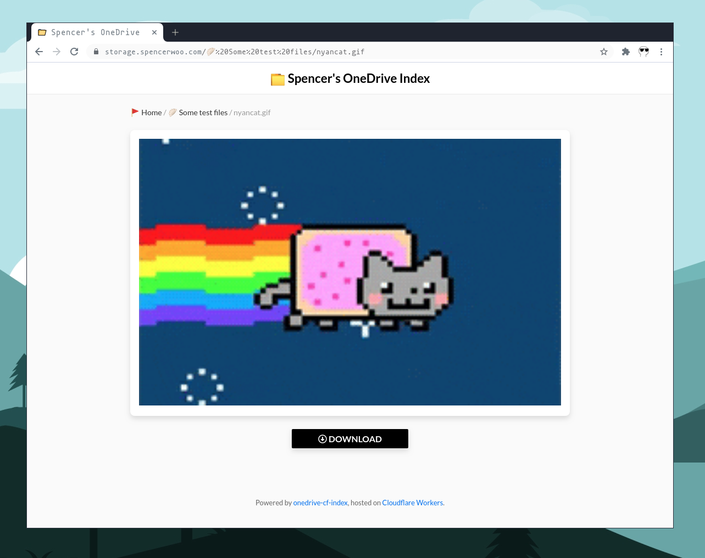
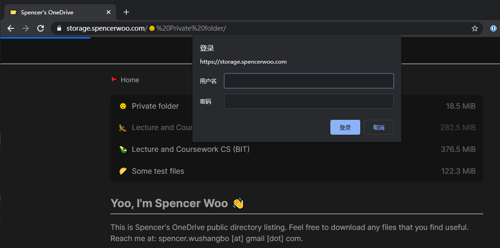
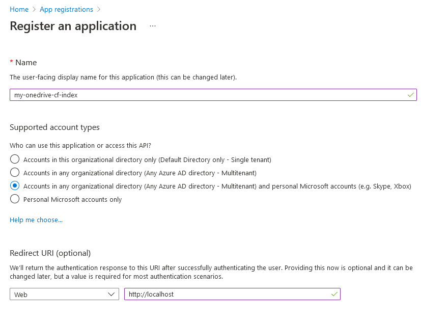
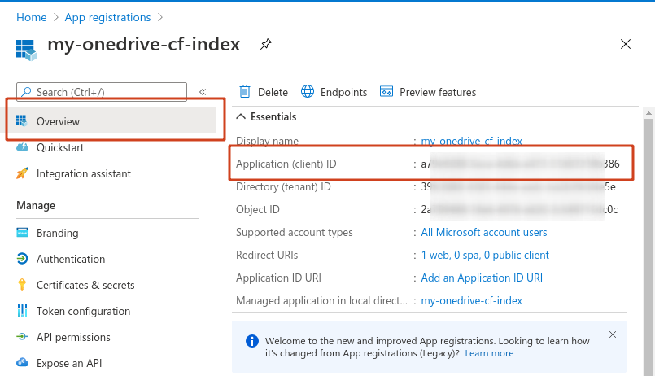
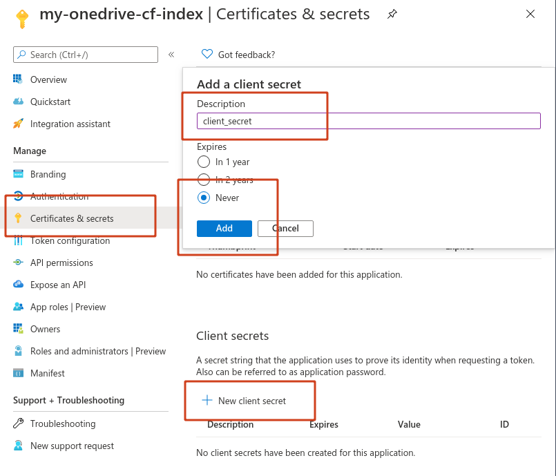
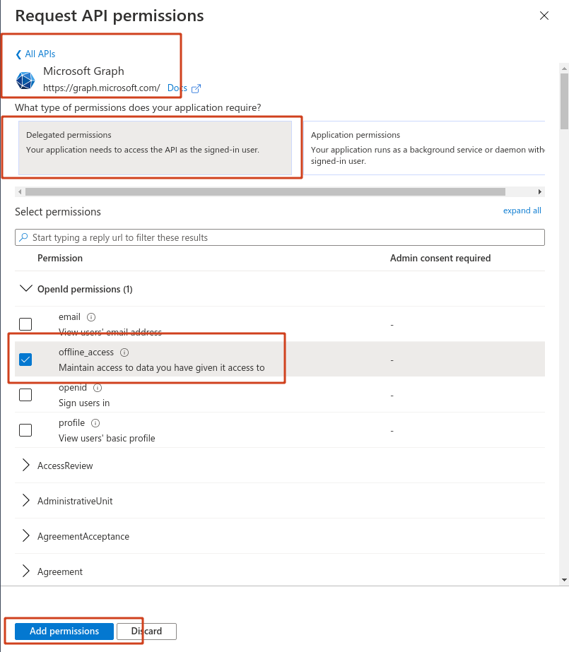
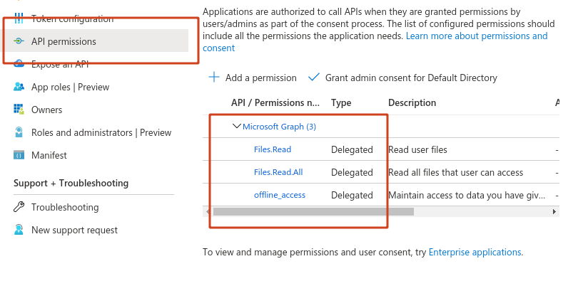

<div align="center">
  <image src="assets/onedrive-cf-index.png" alt="onedrive-cf-index" width="150px" />
  <h3><a href="https://storage.spencerwoo.com">onedrive-cf-index</a></h3>
  <em>Yet another OneDrive index, powered by CloudFlare Workers.</em>
</div>

---

[](https://storage.spencerwoo.com/)
[](https://github.com/spencerwooo/onedrive-cf-index/actions?query=workflow%3ADeploy)
[](./README-CN.md)

<h5>This project uses CloudFlare Workers to host and share your personal OneDrive files. It is greatly inspired by: <a href="https://github.com/heymind/OneDrive-Index-Cloudflare-Worker">onedrive-index-cloudflare-worker</a>.</h5>

## Announcement

`onedrive-cf-index` is currently being refactored as [`onedrive-vercel-index`](https://github.com/spencerwooo/onedrive-vercel-index) for better UX and simplified deployments. New issues and pull requests here will not be monitored and managed for now.

## Demo

Live demo at [Spencer's OneDrive Index](https://storage.spencerwoo.com/).



## Features

### 🚀 General

- Breadcrumbs for better navigations.
- Tokens cached and automatically refreshed with Cloudflare Workers KV storage.
- Route lazy loading with the help of [Turbolinks®](https://github.com/turbolinks/turbolinks).
- Supports OneDrive 21Vianet.（由世纪互联运营的 OneDrive。）
- Supports mounting SharePoint.

### 🗃️ Folder indexing

- Complete new and customisable design at [spencer.css](themes/spencer.css).
- Emoji as folder icon when available (if the first character of the folder name is an emoji).
- Renders `README.md` if found in current folder. Rendered with [github-markdown-css](https://github.com/sindresorhus/github-markdown-css).
- Supports pagination, no more limitations like 200 items max for each folder ever again!

### 📁 File previews

- File icon rendered according to file type, [Font Awesome icons](https://fontawesome.com/) for cleaner look.
- Plain text: `.txt`. [_DEMO_](https://storage.spencerwoo.com/%F0%9F%A5%9F%20Some%20test%20files/Previews/iso_8859-1.txt).
- Markdown: `.md`, `.mdown`, `.markdown`. [_DEMO_](https://storage.spencerwoo.com/%F0%9F%A5%9F%20Some%20test%20files/Previews/i_m_a_md.md).
- Image, supports Medium style zoom effect: `.png`, `.jpg`, and `.gif`. [_DEMO_](https://storage.spencerwoo.com/%F0%9F%A5%9F%20Some%20test%20files/Previews/).
- Code with syntax highlighting: `.js`, `.py`, `.c`, `.json`.... [_DEMO_](https://storage.spencerwoo.com/%F0%9F%A5%9F%20Some%20test%20files/Code/pathUtil.js).
- PDF: Lazy loading, loading progress and built-in PDF viewer. [_DEMO_](<https://storage.spencerwoo.com/%F0%9F%A5%91%20Course%20PPT%20for%20CS%20(BIT)/2018%20-%20%E5%A4%A7%E4%BA%8C%E4%B8%8B%20-%20%E8%AE%A1%E7%AE%97%E6%9C%BA%E5%9B%BE%E5%BD%A2%E5%AD%A6/1%20FoundationofCG-Anonymous.pdf>).
- Music / Audio: `.mp3`, `.aac`, `.wav`, `.oga`. [_DEMO_](https://storage.spencerwoo.com/%F0%9F%A5%9F%20Some%20test%20files/Multimedia/Elysian%20Fields%20-%20Climbing%20My%20Dark%20Hair.mp3).
- Videos: `.mp4`, `.flv`, `.webm`, `.m3u8`. [_DEMO_](https://storage.spencerwoo.com/%F0%9F%A5%9F%20Some%20test%20files/Multimedia/%E8%BD%A6%E5%BA%93%E5%A5%B3%E7%8E%8B%20%E9%AB%98%E8%B7%9F%E8%B9%A6%E8%BF%AA%20%E4%B9%98%E9%A3%8E%E7%A0%B4%E6%B5%AA%E7%9A%84%E5%A7%90%E5%A7%90%E4%B8%BB%E9%A2%98%E6%9B%B2%E3%80%90%E9%86%8B%E9%86%8B%E3%80%91.mp4).

### ⬇️ Proxied / raw file download

- [Optional] Proxied download: `?proxied` - Downloads the file through CloudFlare Workers if (1) `proxyDownload` is true in `config/default.js` and (2) parameter is present in url.
- [Optional] Raw file download: `?raw` - Return direct raw file instead of rich rendered preview if parameter is present.
- Both these parameters can be used side by side, meaning that `?proxied&raw` and `?raw&proxied` are both valid.

Yes, this means you can use this project as an image storage service or for serving static files, for example:

```
https://storage.spencerwoo.com/%F0%9F%A5%9F%20Some%20test%20files/nyancat.gif?raw
```


### 🔒 Private folders



You can limit access to folders (i.e., declaring private folders) by adding their paths to `ENABLE_PATHS` inside `src/auth/config.js`. You can optionally enable this feature with the `AUTH_ENABLED` toggle variable also inside that file, and you can specify the username in `NAME` and the password using wrangler.

Note that the password is stored inside the `AUTH_PASSWORD` Cloudflare Worker secret. You should never commit your password into a git repository, not even a private one. The `AUTH_PASSWORD` secret can be added with wrangler:

```bash
wrangler secret put AUTH_PASSWORD
# Type out your self-defined AUTH_PASSWORD here
```

Check out [the following sections](#preparations) for details on using wrangler to set CloudFlare Worker secrets (which are also called environment variables).

### Others

See the new features section at the original [onedrive-index-cloudflare-worker](https://github.com/heymind/OneDrive-Index-Cloudflare-Worker#-%E6%96%B0%E7%89%B9%E6%80%A7-v11) project page for reference, **although I cannot guarantee that all features are usable.**

## Deployment

_Very, very long, tedious, step by step guide warning!_

### Generating OneDrive API Tokens

1. Create a new blade app here [Microsoft Azure App registrations](https://portal.azure.com/#blade/Microsoft_AAD_RegisteredApps/ApplicationsListBlade) (OneDrive normal version) or [Microsoft Azure.cn App registrations](https://portal.azure.cn/#blade/Microsoft_AAD_RegisteredApps/ApplicationsListBlade) (OneDrive 世纪互联版本):

   1. Login with your Microsoft account, select `New registration`.
   2. Input `Name` for your blade app, `my-onedrive-cf-index` for example.
   3. Set `Supported account types` to `Accounts in any organizational directory (Any Azure AD directory - Multitenant) and personal Microsoft accounts (e.g. Skype, Xbox)`. OneDrive 世纪互联用户设置为：`任何组织目录（任何 Azure AD 目录 - 多租户）中的帐户`.
   4. Set `Redirect URI (optional)` to `Web` (the multiselect dropdown) and `http://localhost` (the URL).
   5. Click `Register`.

   

2. Get your Application (client) ID - `client_id` at `Overview` panel.

   

3. Open `Certificates & secrets` panel, click `New client secret` and create a new secret called `client_secret`, set `Expires` to `Never`, click `Add`, and copy the `Value` of the `client_secret` (**You only have this one chance to copy it.**).

   

4. Open `API permissions` panel, select `Microsoft Graph`, select `Delegated permissions`, search for `offline_access, Files.Read, Files.Read.All`, **select all three of them** and click `Add permissions`.

   

   You should have these permissions ready:

   

5. Get your `refresh_token`. On your local machine that has a working installation of Node.js and npm (See [Preparations](#preparations) for recommendations for installing Node.js and its toolchain), execute the following command:

   ```sh
   npx @beetcb/ms-graph-cli
   ```

   <div align="center"></div>

   Select the options that you need, and enter the tokens that we just acquired from above. The names are self-explanatory. `redirect_url` can be set to `http://localhost`. For more information please go check out the repo at: [beetcb/ms-graph-cli](https://github.com/beetcb/ms-graph-cli).

6. Finally, create a dedicated folder for your public files inside OneDrive, for instance: `/Public`. Please don't share your root folder directly!

After all this hassle, you should have successfully acquired the following tokens and secrets:

- `refresh_token`
- `client_id`
- `client_secret`
- `redirect_uri`
- `base`: Defaults to `/Public`.

_Yes, I know it's a long and tedious procedure, but it's Microsoft, we can understand. 🤷🏼‍♂️_

### Preparations

Fork then clone, or directly clone this repository. Install dependencies locally, you'll need Node.js, `npm` and `wrangler`.

_We strongly recommend you install npm with a Node version manager like [n](https://github.com/tj/n) or [nvm](https://github.com/nvm-sh/nvm), which will allow wrangler to install configuration data in a global node_modules directory in your user's home directory, without requiring that you run as root._

```sh
# Install cloudflare workers official packing and publishing tool
npm i @cloudflare/wrangler -g

# Install dependencies with npm
npm install

# Login to Cloudflare with wrangler
wrangler login

# Verify wrangler status with this command
wrangler whoami
```

Login to your CloudFlare account at <https://dash.cloudflare.com/login>, select your domain, **and scroll down a bit. You'll see your `account_id` and `zone_id` there (on the right sidebar).** Also create a **DRAFT** worker at `Workers` -> `Manage Workers` -> `Create a Worker` with a cool name.

Modify [`wrangler.toml`](wrangler.toml):

- `name`: The draft worker's name, your worker will be published at `<name>.<worker_subdomain>.workers.dev`.
- `account_id`: Your Cloudflare Account ID.
- `zone_id`: Your Cloudflare Zone ID.

Create Cloudflare Workers KV bucket named `BUCKET`:

```sh
# Create KV bucket
wrangler kv:namespace create "BUCKET"

# ... or, create KV bucket with preview functions enabled
wrangler kv:namespace create "BUCKET" --preview
```

Preview is used for local preview test only. It will not affect the image preview on page.

Modify `kv_namespaces` inside [`wrangler.toml`](wrangler.toml):

- `kv_namespaces`: Your Cloudflare KV namespace, you should substitute the `id` and `preview_id` values accordingly. _If you don't need preview functions, you can remove the `preview_id` field._

Modify [`src/config/default.js`](src/config/default.js):

- `client_id`: Your `client_id` from above.
- `base`: Your `base` path from above.
- If you are mounting regular international OneDrive, you can safely ignore the following steps.
- If you are mounting Chinese 21Vianet OneDrive (由世纪互联运营的 OneDrive):
   - Set `accountType` under `type` to `1`.
   - Keep `driveType` unmodified.
- If you are mounting SharePoint:
   - Keep `accountType` unmodified.
   - Set `driveType` under `type` to `1`.
   - Set `hostName` and `sitePath` accordingly.

Add secrets to Cloudflare Workers environment variables with `wrangler` (For `AUTH_PASSWORD` and private folders, refer to [🔒 Private folders](#-private-folders)):

```sh
# Add your refresh_token and client_secret to Cloudflare
wrangler secret put REFRESH_TOKEN
# ... enter your refresh_token from above here

wrangler secret put CLIENT_SECRET
# ... enter your client_secret from above here

wrangler secret put AUTH_PASSWORD
# Type out your self-defined AUTH_PASSWORD here
```

### Building and deployment

You can preview the worker with `wrangler`:

```sh
wrangler preview
```

After making sure everything is ok, you can publish your worker with:

```sh
wrangler publish
```

You can also create a GitHub Actions for auto publishing your worker on `push`. See [main.yml](.github/workflows/main.yml).

For custom domains, refer to [How to Setup Cloudflare Workers on a Custom Domain](https://www.andressevilla.com/how-to-setup-cloudflare-workers-on-a-custom-domain/).

## Customisations

- You can **(AND SHOULD)** change the `intro` on the default landing page here: [src/folderView.js](src/folderView.js#L51-L55). Write HTML directly.
- You can **(AND ALSO SHOULD)** change the header of the site here: [src/render/htmlWrapper.js](src/render/htmlWrapper.js#L24).
- Your custom styles are loaded from [themes/spencer.css](themes/spencer.css), change that according to your customizations. You will also need to change the commit HASH at [src/render/htmlWrapper.js](src/render/htmlWrapper.js#L3).
- You can also customize Markdown CSS styles, PrismJS code highlight color schemes, etc.

---

🏵 **onedrive-cf-index** ©Spencer Woo. Released under the MIT License.

Authored and maintained by Spencer Woo.

[@Portfolio](https://spencerwoo.com/) · [@Blog](https://blog.spencerwoo.com/) · [@GitHub](https://github.com/spencerwooo)
